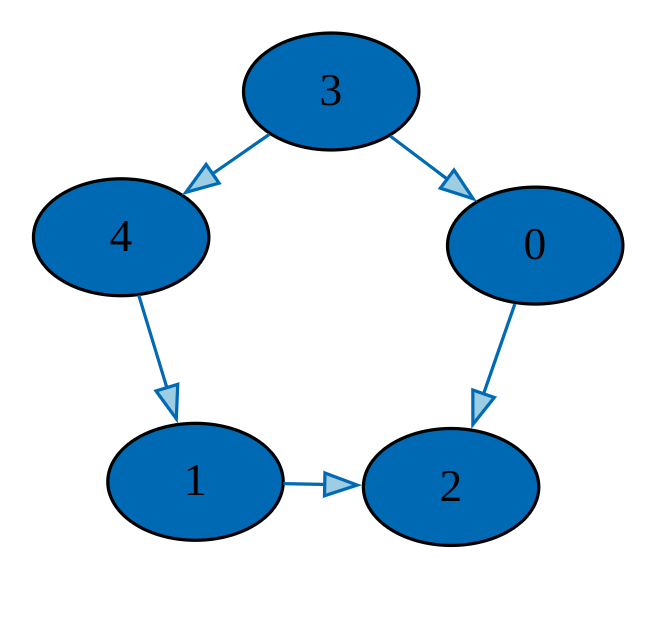

# Graph Traversal (Work-In-Progress / WIP)
This details my experiments doing Depth-First Search (DFS) and Breath First Search (BFS) on a graph data structure.

```graph.py``` provides the implementation of the Graph as a list of nodes.The node at index _i_ of graph holds a list of integer which represent the node.  
The Graph type uses python's type system as a light wrapper around the list of nodes.

```graph_traversal.py``` provides two functions ```dfs``` and ```bfs```. They require three arguements;
- a Graph object ```graph```
- the number of nodes in the graph ```n```
- starting index/node  ```start_index``` - defines which node the traversal starts from

Optionally, the ```visitied``` parameter holds a list of visited/traversed nodes.

The sample graph tested in ```test.py``` is visualized deblow

